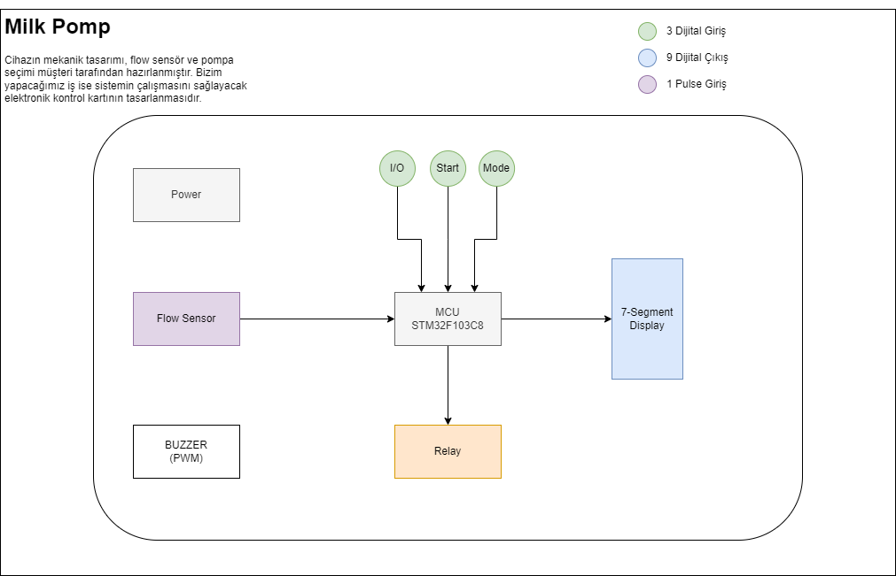

# Milk Pomp
Proje, kullanicinin farkli tip ve hacimli bardaklara makineden süt doldurmak için kullanilacak bir cihazin kontrol kartinin tasarlanmasi işidir.

Cihazın mekanik tasarımı, flow sensör ve pompa seçimi müşteri tarafından hazırlanmıştır. Bizim yapacağımız iş ise sistemin çalışmasını sağlayacak elektronik kontrol kartının tasarlanmasıdır.

## Sistemin Çalismasi
Cihaz maksimum 9 farklı bardak bilgisini hafızada tutabilir. Kullanıcı bardak seçimi yaparak kayıtlı bardak tiplerinden birini otomatik olarak doldurabilir. Fakat istenirse kayıtlı olmayan farklı bir kabı da manuel olarak istediği miktarda doldurabilir.

Cihaz üzerinde 3 adet buton ve 1 adet 7-Segment gösterge bulunmaktadır. Ayrıca, bir pulse girişi ile **Akış Sensoru** girişi okunacak ve çıkış olarak bir role kontrol edilecektir.

	* I/O (On/Off) butonu
	* Start butonu
	* Mode butonu
	* Akış Sensoru (Encoder Pulse Input)
	* Role
	

	
Aşağıda tarif edilen çalışma şekilleri bu 3 buton ve gösterge kullanılarak gerçeklenecektir.

Sistemi çalıştırmak için I/O butonuna bir kere basıp bırakmak yeterlidir. Sistem kapalıyken gösterge ve diğer butonlar aktif değildir. I/O butonuna bir kere basılıp bırakıldığında sistem açılır, eğer kalibrasyon yapılmamışsa (hiç bardak tanımı yoksa) **C.** değeri görünür ve ekran yanıp söner. Aksi halde sabit olarak **0** yazar ve bardak seçimi için bekler.

Cihaz 3 farklı çalışma şekline sahip olacaktır.

### Kalibrasyon
Kalibrasyon modu, elimizde bulunan bardakların tanımlanması için kullanılır. Maksimum 9 farklı bardak tanımı yapılabilir.

Kalibrasyon modu bir adet bardak tanıtmak istenirse aşağıdaki algoritmaya göre çalışır

	1- Kalibrasyonu başlatmak için I/O butonuna 5 saniye basılı tutulur
	2- Gösterge 0 değerini gösterir ve nokta yanıp sönmeye başlar
	3- İstenilen bardak, cihazın bardak bölmesine yerleştirilir
	4- Mode butonu ile bardak seçimi yapılır (1, 2, 3, ..)
	5- Start butonuna basılı tutularak bardak doldurulur
	6- Bardak dolunca Start butonu bırakılır
	7- Start butonu bırakıldığında seçilen bardak ve doldurulan miktar bilgileri otomatik olarak kaydedilir
	8- Kalibrasyon modundan çıkmak için I/O butonuna 5 saniye bayunca basılır
	
Eğer birden fazla bardak tanımı yapılmak istenirse yukarıdaki algoritma basamaklarından 1 nolu adım ile kalibrasyon işlemi başlatılır. 2-7 adımları her bir bardak için tekrarlanır. Tüm bardakların tanımlanma işlemi bittiğinde 8 nolu adım ile kalibrasyon işlemi sonlandırılır.

Daha sonra tanımlı bir bardağın kalibrasyonu değiştirilmek istendiğinde veya yeni bir bardak tanımı yapılması gerektiğinde yukarıdaki algoritma tekrar uygulanabilir.

> Dikkat edilmesi gereken nokta, eğer bardak tanımları yapılmış bir cihazda tek bir bardağın kalibrasyonu değiştirlmek istenirse, Mode butonu ile doğru bardak numarasının seçildiğinden emin olunması gerekmektedir.

### Otomatik Mod
Kalibrasyonu yapılmış bir cihazda kullanıcı bardak seçimi yaparak tanımlı bardaklardan birini otomatik olarak doldurabilir.

	1- İstenilen bardak, cihazın bardak bölmesine yerleştirilir
	2- Mode butonu kullanılarak bardak seçimi yapılır
	3- Start butonuna basılıp bırakıldığında tanımlı miktar kadar dolum yapılır
	
Her bir bardak için yukarıdaki adımlar tekrarlanır.

### Manuel Mod
Kalibrasyon yapılarak tanımlanmamış bir bardak veya farklı bir kap doldurulmak istendiğinde Manuel mod kullanılır.

    1- Doldurulmak istenilen kap yerleştirilir.
	2- Start butonuna basılı tutulur. Butona basıldıktan 5 saniye sonra manuel dolum başlar
	3- Kullanıcı Start butonunu bıraktığında dolum işlemi sonlanır.

## Kaynak/Arastirmalar
- [Flow Sensor](https://www.hepsiburada.com/fluidotech-kahve-makinasi-pompasi-rotary-pompa-pirinc-govdeli-p-HBV000007SB1Q)
- [Flow Sensor Kullanimi](https://how2electronics.com/iot-water-flow-meter-using-esp8266-water-flow-sensor/)
- [ESP8266 With Water Flow Sensor](https://www.14core.com/wiring-esp8266-1212e-with-g12-liquid-water-flow-sensor-for-wireless-monitoring/)

## Kullanilacak Bilesenler
- [STM32G030F6P6TR](docs/DS12991.pdf) 
- [Relay](http://www.omron.com/ecb/products/pdf/en-g5le.pdf)
- [Display](https://docs.broadcom.com/docs/AV02-2553EN)
- [TLP291](https://toshiba.semicon-storage.com/info/docget.jsp?did=12884&prodName=TLP291)
- Buttons
- Buzzer 
- Resistors
- Capasitors
- Transistors
- Leds
## Algoritma Adimlari
    1) Basla
	2) I/O Butonuna bir kere basarak sistemi ac (Diger hersey pasif olmali)
	3) Eger Kalibrasyon yapilmamissa C.yanip soner once kalibrasyon yapilmali. Eger Kalibrasyon yapilmissa 14.adima git(ilk acilis icin gecerli)
	4) Kalibrasyonu başlatmak için I/O butonuna 5 saniye basılı tutulur
	5) Gösterge 0 değerini gösterir ve nokta yanıp sönmeye başlar
	6) İstenilen bardak, cihazın bardak bölmesine yerleştirilir
	7) Mode butonu ile bardak seçimi yapılır (1, 2, 3, ..)
	8) Start butonuna basılı tutularak bardak doldurulur
	9) Bardak dolunca Start butonu bırakılır
	10) Start butonu bırakıldığında seçilen bardak ve doldurulan miktar bilgileri otomatik olarak kaydedilir
	11) Kalibrasyon modundan çıkmak için I/O butonuna 5 saniye bayunca basılır
	12) Max 9 bardak tanimlanibilir, tanimlanma islemi bittikten sonra 11 adimla islem tamamlanir
	13) Eger birden fazla bardak tanimi yapilmak istenilirse 4 adimdan baslayip 5-11 arasi adimlar tekrarlanir
	14) Eger kalibrasyon yapilmissa ekranda 0 yazar ve bekler
	15) Iki farkli sekilde bardak doldurabilir otomatik ve manuel biri secilir
	16) Eger otomatik ise islem soyle devam eder
	17) İstenilen bardak, cihazın bardak bölmesine yerleştirilir
	18) Mode butonu kullanılarak bardak seçimi yapılır(ornek 1.bardak 0-100ml alir,2.bardak 200-300ml alir)
	19) Start butonuna basılıp bırakıldığında tanımlı miktar kadar dolum yapılır her bardak icin islem tekrar edilir
	20) Eger manuel ise oldurulmak istenilen kap yerleştirilir
	21) Start butonuna basılı tutulur. Butona basıldıktan 5 saniye sonra manuel dolum başlar
	22) Kullanıcı Start butonunu bıraktığında dolum işlemi sonlanır
   

 

